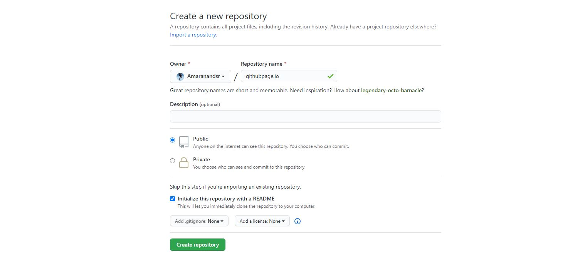
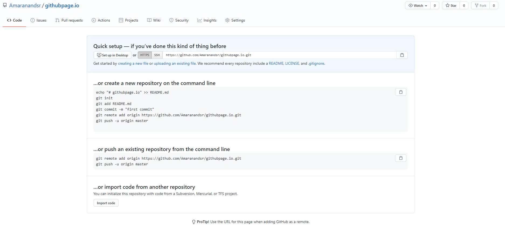

### Host-Files-on-Github

# How to Host Files on GitHub

### Don't have GitHub account
*Go to ["GitHub"](https://github.com/) and sign-up for a free account, if you don’t have one. Choose the free plan as that’s all we need for hosting our files.*

---
### Have GitHub account
**Step 1:** 
*Click the [“New Repository”](https://github.com/new/) button, to create a new repository for hosting your files.*

**Step 2:**
*Give your repository named username.github.io, where username is your username or organization name and click the Create button*

**Step 3:**
*Download [GitHub Desktop](https://desktop.github.com/), depending on your operating system. Open the app and log in using the account you just created.*

**Step After GitHub Desktop Open:**
* Grab your favorite text editor and add an index.html file to your project
* Enter the repository, commit your changes, and press the publish button.

---
## Upload Files to GitHub
*Click the Upload Files files button and begin uploading files. You can drag one or more files from the desktop and then click Commit Changes to publish the files on the web. GitHub will accept any file as long as the size is within the 25 MB limit.*

---
## Direct URLs for GitHub Files
*After the file has been uploaded to Github, click the filename in the list and you’ll get the file’s URL in the browser’s address. Append ?raw=true to the URL and you get a downloadable / embeddable version.*

---
## Repository Settings
**Step 1:**
*Head over to ["GitHub"](https://github.com/) and create a new repository, or go to an existing one.
Click on the **Settings tab.***

**Step 2:**
Scroll down to the **GitHub Pages** section. Press **Choose a theme**.

**Step 3:**
Choose one of the themes from the carousel at the top.
When you're done, click **Select theme** on the right.

*Use the editor to add content to your site.
Enter a commit comment and click on Commit changes below the editor.*

## …and you're done!
